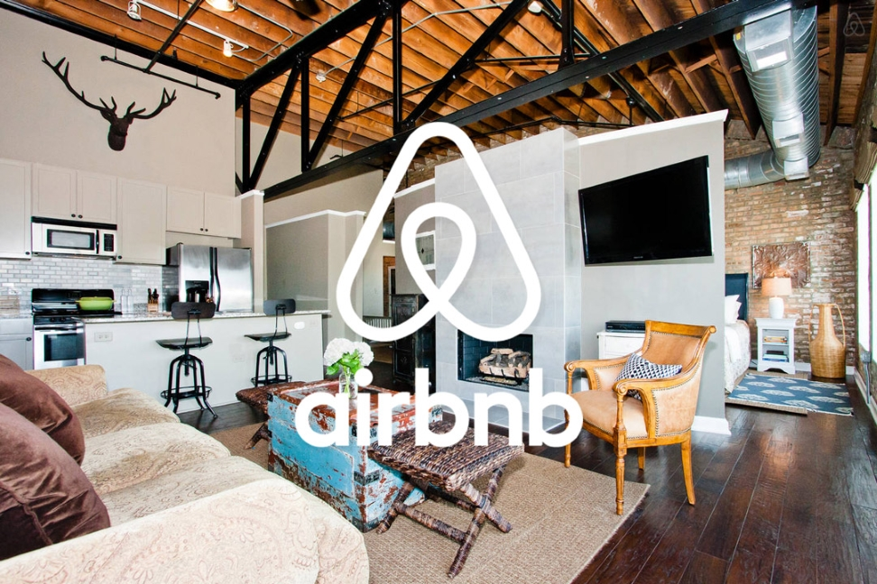

# Competición de Machine Learning
## Introducción:


Con el fin de poner practica los conocimientos adquiridos en machine learning desde Ironhack, organizaron en Kaggle una competición entre todos los alumnos, para ver cual de nosotros predecía mejor el precio de un alojamiento de la plataforma Airbnb en Amsterdam.

A nuestra disposción había 2 archivos csv, uno para el entrenamiento de los modelos con caracteristicas y precios de varios alojamientos y otro solo con características que sería utilizado para predecir el precio y entregar para clasificar en la competición.


## Fuentes de los datos:

 - https://www.kaggle.com/competitions/ironhack-airbnb-datamad0322


## Objetivos:

- Limpiar y arreglar datos. 
- Entrenar y testear modelos.
- Evaluar y ajustar modelos.
- Predecir y presentar resultados.


## Entregables:

- `LinearRegresion.ipynb`
- `Lasso.ipynb` 
- `RandomForestRegressor.ipynb`
- `GradientBoostingRegressor.ipynb`
- `H2O.ipynb`
- `testing_models.ipynb`
- `my_functions.ipynb`


## Exploración, limpieza y transformación:

Antes de nada importo lo csv y realizo una EDA (análisis exploratorio de los datos), continuo limpiando valores nulos, constantes, outliers, eliminando columnas con poca coorrelación con el precio, limpiando y arreglando las strings 

Realizo transformaciones en los valores númericos(normalizaciones, compresiones...) y los categoricos los convierto en numéricos (one-hot-encoding, label encoding). Para todas estas modificaciones me creo un archivo con funciones para ir llamandolas en  función del modelo.


## Entrenar y testear modelos:

 
Una vez los datos están arreglados, divido mi paquete de datos en 80% para entrenar y 20% para testear y hago un primer entreno en bucle de listados de modelos(LinealRegression, SupportVectorRegressor, RandomForest, Boosting, H2O).

El 20% restante lo uso para evualuar cado uno de los modelos utilizando principalmente dos métricas (RMSE y R2) y así poder determina cual de los modelos tiene mejor rendimiento.


## Entrenar y testear modelos:

Me quedo finalmente con 5 modelo:

- Linear Regresion
- Lasso
- Random Forest Regressor
- Gradient Boosting Regressor
- H2O

Le aplico técnicas de ajuste de hyperparametros (Random Grid Searching, HyperOpt...) para afinar al máximo las predicciones.

## Entrenar y testear modelos:

Por último utilizo el archivo de test para realizar las predicciones con los 5 modelos y presentar los resultados para la competición


## Enlaces y Recursos:


- <https://numpy.org/doc/1.18/>
- <https://pandas.pydata.org/>
- https://docs.python.org/3/library/functions.html
- https://matplotlib.org/
- https://seaborn.pydata.org/
- https://pandas.pydata.org/docs/
- https://docs.python-requests.org/en/latest/
- https://scikit-learn.org/stable/#
- https://docs.h2o.ai/h2o/latest-stable/h2o-docs/data-science.html


```python

```
